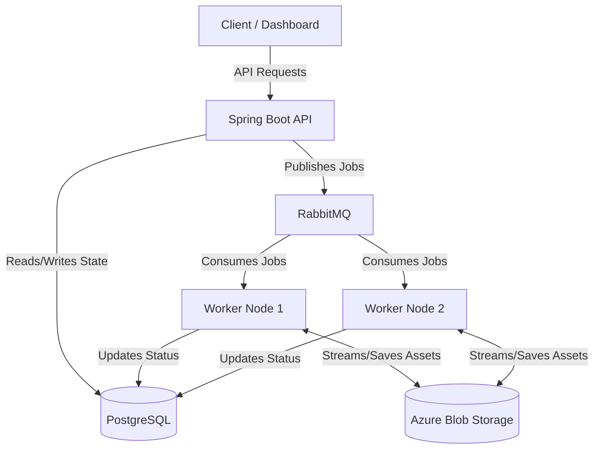

# Sluice

**Sluice** is an open-source, cloud-native media infrastructure platform designed to handle complex media processing workflows at scale. 

Instead of building custom upload, queueing, storage, and processing logic for every application, Sluice provides a robust, modular pipeline engine. Developers can simply define their processing steps, and Sluice handles the distributed execution.

## 🚀 Key Features

- **Extensible Pipelines:** Define ordered sequences of processing steps (e.g., Resize → Watermark → Upload).
- **Asynchronous Execution:** Long-running jobs are executed asynchronously by distributed workers, ensuring the control API remains highly responsive.
- **Pluggable Processors:** Easily add new processors for Image Optimization, Format Conversion, OCR, AI Captions, and Metadata Extraction.
- **Cloud-Native by Design:** Built for Kubernetes, leveraging distributed messaging and storage.

---

## 🏗️ Architecture

Sluice employs an event-driven, decoupled architecture to ensure horizontal scalability and resilience.



### Core Concepts
- **Asset**: A file ingested into Sluice.
- **Pipeline**: An ordered sequence of configured processing steps.
- **Processor**: A reusable unit of compute (e.g., `ImageResizeProcessor`).
- **Job**: A single execution instance of a Pipeline against an Asset.
- **Worker**: A stateless service responsible for executing processors.
- **Queue**: Coordinates asynchronous task distribution.

---

## 🛠️ Technology Stack

Designed as a modern, enterprise-grade system, Sluice leverages the following technologies:

| Domain | Technology |
|---|---|
| **Backend Core** | Java 25, Spring Boot 4, Spring Framework 7, Gradle |
| **Frontend Dashboard** | Next.js, React, TypeScript, Tailwind CSS, shadcn/ui |
| **Database & Cache** | PostgreSQL, Valkey |
| **Messaging & Storage** | RabbitMQ, Azure Blob Storage |
| **Infrastructure** | Docker, Kubernetes, Terraform |
| **Observability** | OpenTelemetry, Prometheus, Grafana, Loki |
| **Testing** | JUnit, Mockito, Testcontainers |

---

## 🗺️ Implementation Roadmap

To manage complexity and optimize for learning distributed systems fundamentals, Sluice is being built incrementally.

### Phase 1: The Vertical Slice (Completed)
**Goal:** Establish the core ingestion API.
**Scope:** Upload an asset synchronously via the Spring Boot API, persist the raw file directly to Azure Blob Storage, save metadata to PostgreSQL, and return the generated Asset ID.
*Note: This phase intentionally omits queues to establish a solid baseline for asset storage.*

### Phase 2: Asynchronous Workers (Current)
**Goal:** Introduce the execution layer.
**Scope:** Integrate RabbitMQ. The API publishes an event upon upload, and a distributed Worker consumes the message to execute basic processing tasks asynchronously.

### Phase 3: Pipeline Orchestration
**Goal:** Support multi-step processing workflows.
**Scope:** Implement a Pipeline Engine capable of orchestrating complex jobs (e.g., chaining processors) and managing state transitions within the database.

### Phase 4: Resiliency & Reliability
**Goal:** Handle distributed failures gracefully.
**Scope:** Implement Dead Letter Queues (DLQs), exponential backoff retries, and idempotency guarantees across all workers.

### Phase 5: Real-time Updates & Direct Uploads
**Goal:** Optimize client performance.
**Scope:** Introduce SAS URLs for direct-to-storage client uploads (bypassing the API buffer) and Server-Sent Events (SSE) for real-time job status updates in the dashboard.

---

## 💻 Getting Started

1. Clone the repository:
   ```bash
   git clone https://github.com/sluice-hq/sluice.git
   cd sluice
   ```
2. Start the local infrastructure (PostgreSQL, Azurite) using Docker Compose:
   ```bash
   docker-compose up -d
   ```
3. Navigate to the backend directory and run the Spring Boot API:
   ```bash
   cd backend
   ./gradlew bootRun
   ```
