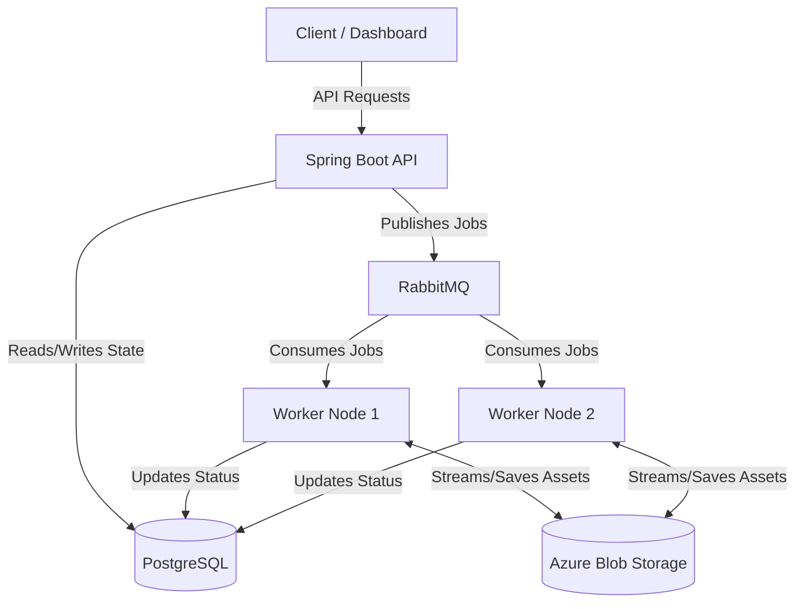

# Sluice

**Sluice** is an open-source, cloud-native media infrastructure platform designed to handle complex media processing workflows at scale. It provides a functional, end-to-end media pipeline—from secure, direct-to-storage uploads to distributed background processing and real-time dashboard updates.

By offering a modular Pipeline Engine and pluggable architecture, Sluice executes media processing workflows asynchronously, keeping the control API highly responsive and paving the way for fully user-configurable pipelines in future releases.

## 🚀 Key Features

- **Pipeline Engine:** Execute ordered processing pipelines through a modular, extensible architecture.
- **Asynchronous Execution:** Long-running jobs are executed asynchronously by distributed workers, ensuring the control API remains highly responsive.
- **Pluggable Processors:** Easily add new processors for Image Optimization, Format Conversion, OCR, AI Captions, and Metadata Extraction.
- **Cloud-Native by Design:** Built for Kubernetes, leveraging distributed messaging and storage.

---

## 🏗️ Target Architecture

The diagram below represents the long-term target architecture that future milestones will progressively implement. Once complete, Sluice will employ an event-driven, decoupled architecture to ensure horizontal scalability and resilience. 

*Note: The current implementation features a production-quality Next.js dashboard, direct client-to-storage ingestion via Azure SAS URLs, and real-time job updates via Server-Sent Events (SSE). On the backend, it leverages Azure Blob Storage, PostgreSQL, and RabbitMQ to drive asynchronous job processing through a modular Pipeline Engine with reliable messaging (retries, idempotency, and dead-letter queues). Future work includes configurable pipeline definitions, media governance, and cloud deployment.*



### Core Concepts
- **Asset**: A file ingested into Sluice.
- **Pipeline**: An ordered sequence of configured processing steps.
- **Processor**: A reusable unit of compute (e.g., `ImageResizeProcessor`).
- **Job**: A single execution instance of a Pipeline against an Asset.
- **Worker**: A stateless service responsible for executing processors.
- **Queue**: Coordinates asynchronous task distribution.

---

## 🛠️ Technology Stack

Designed as a modern, enterprise-grade system, Sluice leverages the following technologies:

| Domain | Technology |
|---|---|
| **Backend Core** | Java 25, Spring Boot 4, Spring Framework 7, Gradle |
| **Frontend Dashboard** | Next.js, React, TypeScript, Tailwind CSS, shadcn/ui, TanStack Query, Zod |
| **Database & Migrations** | PostgreSQL, Flyway |
| **Messaging & Storage** | RabbitMQ, Azure Blob Storage |
| **Infrastructure** | Docker, Azure, Kubernetes (AKS), Terraform |
| **Observability** | OpenTelemetry, Prometheus, Grafana, Loki |
| **Testing** | JUnit, Mockito, Testcontainers |

---

## 🗺️ Implementation Roadmap

To manage complexity and optimize for learning distributed systems fundamentals, Sluice is being built incrementally.

### Phase 1: The Vertical Slice (Completed)
**Goal:** Establish the core ingestion API.
**Scope:** Upload an asset synchronously via the Spring Boot API, persist the raw file directly to Azure Blob Storage, save metadata to PostgreSQL, and return the generated Asset ID.
*Note: This phase intentionally omits queues to establish a solid baseline for asset storage.*

### Phase 2: Asynchronous Workers (Completed)
**Goal:** Introduce the execution layer.
**Scope:**
- RabbitMQ integration
- Job creation and persistence
- Asynchronous background workers
- Job lifecycle tracking
- Job status API
- Basic background processing

### Phase 3: Pipeline Orchestration (Completed)
**Goal:** Introduce a modular processing architecture.
**Scope:** 
- Pipeline Engine
- Processor abstraction
- ProcessingContext
- Modular processing pipeline
- MetadataProcessor
- ChecksumProcessor
- ThumbnailProcessor
- Extensible processor architecture

### Phase 4: Resiliency & Reliability (Completed)
**Goal:** Handle distributed failures gracefully.
**Scope:** 
- Dead Letter Queues (DLQs)
- Exponential backoff retries
- Message idempotency guarantees

### Phase 5: Real-time Updates & Direct Uploads (Completed)
**Goal:** Optimize client performance.
**Scope:** 
- Direct-to-storage uploads using Azure SAS URLs
- Real-time job status updates using Server-Sent Events (SSE)

### Phase 6: Dashboard & User Experience (Completed)
**Goal:** Build the primary web interface for Sluice.
**Scope:**
- Dashboard overview with live platform metrics
- Asset management dashboard
- Job management dashboard
- Direct uploads using Azure SAS URLs
- Live job status updates via Server-Sent Events (SSE)
- Professional Next.js frontend architecture

### Phase 7: Configurable Pipelines (Current)
**Goal:** Allow developers to define custom processing workflows.
**Scope:**
- JSON pipeline definitions
- Configurable processors
- Pipeline validation
- User-defined pipeline execution

### Phase 8: Media Governance & AI
**Goal:** Introduce intelligent media orchestration and governance.
**Scope:**
- AI-assisted pipeline generation
- Media governance policies
- Content moderation
- OCR and document understanding
- PII detection and redaction
- Face detection and anonymisation

### Phase 9: Cloud Infrastructure & DevOps
**Goal:** Deploy Sluice as a production-ready cloud platform.
**Scope:**
- Azure deployment
- Azure Kubernetes Service (AKS)
- Terraform infrastructure
- GitHub Actions CI/CD
- Container Registry
- Production configuration
- OpenTelemetry, Prometheus, and Grafana integration

### 🚧 More Phases Coming Soon

The roadmap will continue to evolve as Sluice grows, with future milestones expanding the platform across areas such as scalability, AI, governance, and developer experience.

---

## 🔮 Future Vision

Sluice aims to evolve beyond a media processing platform into an intelligent media orchestration and governance platform.

Future releases will support policy-driven and AI-assisted pipeline orchestration capable of automatically selecting appropriate processing workflows based on developer intent. Example future capabilities include:

- AI-assisted pipeline generation
- Media governance
- Content moderation
- OCR and document understanding
- Face detection and anonymisation
- PII detection and redaction
- Intelligent processor selection

*(Note: These features are part of the long-term vision for the platform and are not yet implemented.)*

---

## 💻 Getting Started

1. Clone the repository:
   ```bash
   git clone https://github.com/sluice-hq/sluice.git
   cd sluice
   ```
2. Start the local infrastructure (PostgreSQL, RabbitMQ, Azurite) using Docker Compose:
   ```bash
   docker-compose up -d
   ```
3. Start the Spring Boot backend API:
   ```bash
   cd backend
   ./gradlew bootRun
   ```
4. Start the Next.js frontend dashboard (in a new terminal):
   ```bash
   cd frontend
   npm ci
   npm run dev
   ```
5. Navigate to [http://localhost:3000](http://localhost:3000) to access the Sluice Dashboard.
6. **Test the Platform:** Upload an asset through the dashboard to experience the complete direct-to-storage upload, asynchronous background processing, and real-time job tracking workflow.
