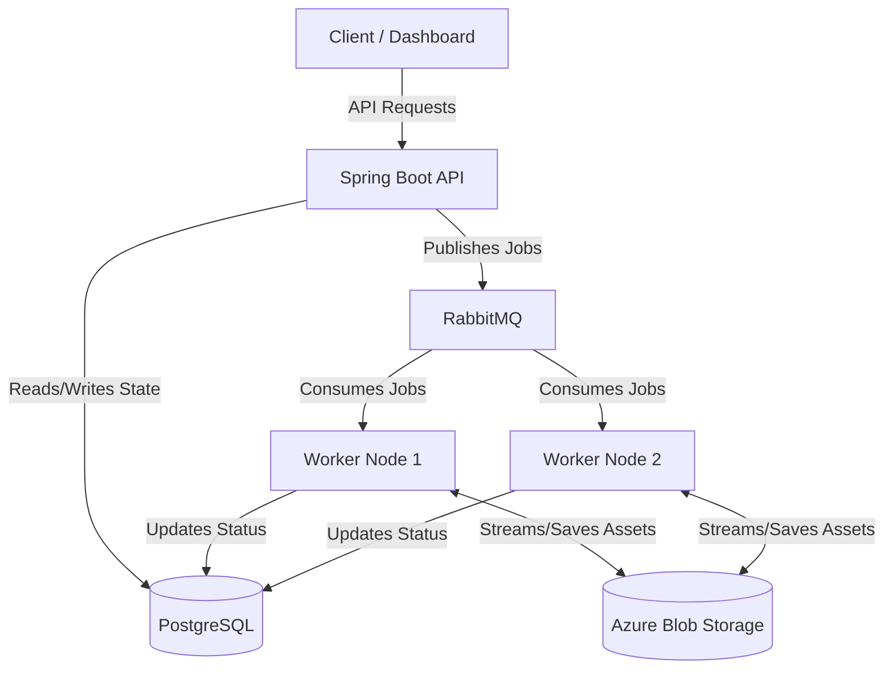

# Sluice

**Sluice** is an open-source, cloud-native media infrastructure platform designed to handle complex media processing workflows at scale. It provides a functional, end-to-end media pipeline from secure, direct-to-storage uploads to distributed background processing and real-time dashboard updates.

By offering a modular Pipeline Engine and pluggable architecture, Sluice executes media processing workflows asynchronously, keeping the control API highly responsive and paving the way for fully user-configurable pipelines in future releases.

## 🚀 Key Features

- **Pipeline Engine:** Execute ordered processing pipelines through a modular, extensible architecture.
- **Asynchronous Execution:** Long-running jobs are executed asynchronously by stateless workers, allowing the processing layer to scale horizontally.
- **Pluggable Processors:** Processors can be added for capabilities such as image optimisation, format conversion, OCR, AI captions, and metadata extraction.
- **Cloud-oriented architecture:** Designed for cloud storage, asynchronous workers, and horizontal scaling, with Kubernetes deployment planned for a future milestone.

---

## 🏗️ Target Architecture

The diagram below represents the long-term target architecture that future milestones will progressively implement. Once complete, Sluice will employ an event-driven, decoupled architecture to ensure horizontal scalability and resilience.

_Note: The platform is being extended with a Next.js developer dashboard, direct client-to-storage ingestion via Azure SAS URLs, and real-time job updates via Server-Sent Events (SSE). On the backend, it leverages Azure Blob Storage, PostgreSQL, and RabbitMQ to drive asynchronous job processing through a dynamic, JSON-configured Pipeline Engine with reliable messaging (retries, idempotency, and dead-letter queues)._



### Core Concepts

- **Asset**: A file ingested into Sluice.
- **Pipeline**: A generic workflow definition (e.g. "Thumbnail Generator").
- **PipelineVersion**: An immutable, JSON-configured execution graph that strictly enforces MIME type compatibility.
- **Processor**: A reusable unit of compute (e.g., `ResizeProcessor`) that advertises its `ProcessorMetadata`.
- **Job**: A single execution instance of a specific `PipelineVersion` against an Asset.
- **Worker**: A stateless service responsible for resolving and executing the pipeline.
- **Queue**: Coordinates asynchronous task distribution.

---

## 🛠️ Technology Stack

- Java 17, Spring Boot 4, Gradle
- Next.js, React, TypeScript, Tailwind CSS, shadcn/ui, TanStack Query, Zod
- PostgreSQL, Flyway
- RabbitMQ, Azure Blob Storage
- Docker
- JUnit, Mockito

---

## 🗺️ Implementation Roadmap

To manage complexity and optimize for learning distributed systems fundamentals, Sluice is being built incrementally.

### Phase 1: The Vertical Slice (Completed)

**Goal:** Establish the core ingestion API.
**Scope:** Upload an asset synchronously via the Spring Boot API, persist the raw file directly to Azure Blob Storage, save metadata to PostgreSQL, and return the generated Asset ID.
_Note: This phase intentionally omits queues to establish a solid baseline for asset storage._

### Phase 2: Asynchronous Workers (Completed)

**Goal:** Introduce the execution layer.
**Scope:**

- RabbitMQ integration
- Job creation and persistence
- Asynchronous background workers
- Job lifecycle tracking
- Job status API
- Basic background processing

### Phase 3: Pipeline Orchestration (Completed)

**Goal:** Introduce a modular processing architecture.
**Scope:**

- Pipeline Engine
- Processor abstraction
- ProcessingContext
- Modular processing pipeline
- MetadataProcessor
- ChecksumProcessor
- ThumbnailProcessor
- Extensible processor architecture

### Phase 4: Resiliency & Reliability (Completed)

**Goal:** Handle distributed failures gracefully.
**Scope:**

- Dead Letter Queues (DLQs)
- Exponential backoff retries
- Message idempotency guarantees

### Phase 5: Real-time Updates & Direct Uploads (Completed)

**Goal:** Optimize client performance.
**Scope:**

- Direct-to-storage uploads using Azure SAS URLs
- Real-time job status updates using Server-Sent Events (SSE)

### Phase 6: Dashboard & User Experience (Completed)

**Goal:** Build the primary web interface for Sluice.
**Scope:**

- Dashboard overview with live platform metrics
- Asset management dashboard
- Job management dashboard
- Direct uploads using Azure SAS URLs
- Live job status updates via Server-Sent Events (SSE)
- Next.js dashboard and frontend architecture

### Phase 6.5: Processing Engine Hardening & Media Foundation (Completed)

**Goal:** Harden the backend engine and prepare for configurable workflows.
**Scope:**

- Transactional boundaries and concurrency safeguards
- `@Version` optimistic locking for safe job transitions
- Self-healing orphan and zombie job recovery services
- `MediaResource` stream-based abstractions for safe file handling
- Extensible `ProcessorResult` contract and core MIME/Resize/WebP processors

### Phase 7: Dynamic Pipeline Versioning (Completed)

**Goal:** Allow developers to define custom processing workflows.
**Scope:**

- JSON pipeline definitions
- Configurable processors
- Pipeline validation
- Developer-defined pipeline execution

### Phase 8: Productisation & API Security (Completed)

**Goal:** Introduce multi-tenant isolation and secure M2M authentication.
**Scope:**

- Project-level tenant isolation
- API key authentication for machine-to-machine integrations
- JWT authentication for human users
- Strict boundary checks across data APIs

**Result:** External applications can authenticate with a project API key while resources remain isolated by project.

### Phase 9: Developer Platform & Dashboard (Current)

**Goal:** Build a fully usable Developer Platform.
**Scope:**

- Developer Signup and Login
- Dashboard Project Management
- API Key Generation and Revocation
- Backend-for-Frontend (BFF) authentication via Next.js
- HttpOnly Cookie Session Management

**Result:** Developers can manage projects and API credentials through the Sluice dashboard.

### Phase 10: Cloud Infrastructure & DevOps

**Goal:** Deploy Sluice as a production-ready cloud platform.
**Scope:**

- Azure deployment
- Azure Kubernetes Service (AKS)
- Terraform infrastructure
- GitHub Actions CI/CD
- Container Registry
- Production configuration
- OpenTelemetry, Prometheus, and Grafana integration

### 🚧 Future Direction

Sluice aims to evolve beyond a media processing platform into an intelligent media orchestration and governance platform. Future milestones will expand the platform across areas such as scalability, AI-assisted orchestration, media governance, and advanced developer experience.

---

## 💻 Getting Started

1. Clone the repository:
   ```bash
   git clone https://github.com/sluice-hq/sluice.git
   cd sluice
   ```
2. Start the local infrastructure (PostgreSQL, RabbitMQ, Azurite) using Docker Compose:
   ```bash
   docker-compose up -d
   ```
3. Start the Spring Boot backend API:
   ```bash
   cd backend
   ./gradlew bootRun
   ```
4. Start the Next.js frontend dashboard (in a new terminal):
   ```bash
   cd frontend
   npm ci
   npm run dev
   ```
5. Navigate to [http://localhost:3000](http://localhost:3000) to access the Sluice Dashboard.
6. **Test the Platform:** Upload an asset through the dashboard to experience the complete direct-to-storage upload, asynchronous background processing, and real-time job tracking workflow.
