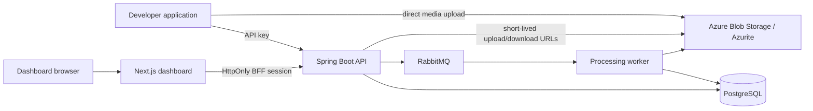

# Sluice

Sluice is an API-first media processing platform. A developer application authenticates with a project API key, uploads media directly to object storage, starts a processing job, and reads the asset/job result through the API. The Next.js dashboard is the human control plane for projects, keys, assets, jobs, and testing.

This repository is an early, working foundation—not the finished V1. Identity, project isolation, API keys, direct uploads, asynchronous jobs, versioned processor contracts, a curated processor market, JSON/Form pipeline authoring, and a dashboard are implemented. The final `/runs` API, durable step analytics, governance, Prometheus/Grafana setup, and Azure deployment are planned work.

## What works today

- Developer signup, login, logout, project creation, project switching, and HttpOnly dashboard sessions.
- Project-scoped JWT and API-key authentication.
- One-time API-key reveal, hash-only persistence, revocation, and throttled last-used tracking.
- Project-isolated assets, pipelines, jobs, and dashboard queries.
- Direct Azure Blob/Azurite upload URLs, upload completion checks, and short-lived download URLs.
- RabbitMQ-backed asynchronous jobs with worker processing, retries, recovery scans, and SSE job events.
- Versioned pipeline authoring with canonical JSON/Form editing, processor-version validation, immutable publishing, stable aliases, and history.
- Dashboard pages for overview, assets, jobs, upload testing, login/signup, projects, API keys, pipelines, and the processor market.
- RFC-style problem responses for validation, authentication, authorization, and database conflicts.

## Current limitations

The following are intentionally not claimed as complete yet:

- The public API still uses the legacy asset-completion flow; the final separate `/uploads` and `/runs` contract is planned.
- Reusable `/uploads` and `/runs`, durable step facts, webhooks, idempotency, quotas, governance decisions, and OpenAPI quick starts are planned.
- WebP fails closed when an encoder is unavailable. No production WebP/AVIF codec is bundled yet.
- Dashboard charts, search, notifications, health, and pagination still contain placeholder UI and are not product metrics.
- Azure resources and deployment automation are not in this branch yet.
- Arbitrary custom processor code is outside V1 for safety reasons.

The detailed implementation plan is maintained locally in `SDD.md`. It is intentionally ignored by Git.

## Architecture



| Responsibility | Local development | V1 Azure target |
|---|---|---|
| Dashboard | Next.js development server | Azure Container App |
| API | Spring Boot process | Azure Container App |
| Worker | Spring AMQP/RabbitMQ listener | Queue-scaled Azure Container App |
| Relational data | PostgreSQL 16 | Azure Database for PostgreSQL Flexible Server |
| Media bytes | Azurite | Private Azure Blob Storage |
| Work queue | RabbitMQ | Azure Service Bus |
| Secrets | Environment variables | Key Vault and Managed Identity |
| Telemetry | Actuator foundation | Azure Monitor/Application Insights, with Prometheus/Grafana planned |

The API creates state and queues work. Workers perform media processing. Project IDs are enforced in the authentication context and repository queries. The browser never receives the dashboard JWT; the Next.js backend-for-frontend stores it in an HttpOnly cookie.

## Technology

- Java 17, Spring Boot 4.1, Spring MVC, Spring Security, Spring Data JPA
- PostgreSQL and Flyway
- RabbitMQ and Spring AMQP
- Azure Blob Storage SDK with Azurite for local development
- Next.js 16, React 19, TypeScript, Tailwind CSS, and TanStack Query
- Gradle, npm, Docker Compose, JUnit, Mockito, and Testcontainers

## Prerequisites

- Java 17
- Node.js 20.9 or newer with npm
- Docker Desktop with the Docker engine running

Docker is required for the local PostgreSQL/RabbitMQ/Azurite stack and for backend integration tests. The integration tests create a disposable PostgreSQL database named `sluice_test`; they do not clean or reuse the development database.

Check Docker before testing:

```powershell
docker version
```

If Testcontainers reports that it cannot find a Docker environment, start Docker Desktop and rerun the command above before running Gradle tests.

## Start the local application

From the repository root, start local infrastructure:

```powershell
docker compose up -d
```

Start the backend in a second terminal:

```powershell
cd backend
.\gradlew.bat bootRun
```

Start the dashboard in a third terminal:

```powershell
cd frontend
npm ci
npm run dev
```

Open [http://localhost:3000/signup](http://localhost:3000/signup), create an account and project, then open Settings to create an API key. The backend listens on [http://localhost:8080](http://localhost:8080). RabbitMQ management is at [http://localhost:15672](http://localhost:15672).

Stop the local services while retaining their Docker volumes:

```powershell
docker compose down
```

To remove the local database, queue, and Azurite data as well, use `docker compose down -v`. This deletes only the named local Compose volumes.

## API-first developer flow

The dashboard is useful for creating a project and revealing a key, but applications should use the API.

### Authentication

Human dashboard requests use a JWT and `X-Project-ID`. Machine requests use a project API key:

```http
X-API-Key: sl_live_<one-time-secret>
```

The raw key is returned only from `POST /api/v1/projects/{projectId}/api-keys`. Sluice stores a SHA-256 hash and cannot show the raw value again.

### Current endpoint flow

All paths below include the `/api/v1` prefix.

| Method | Endpoint | Purpose |
|---|---|---|
| `POST` | `/auth/signup` | Create a user and owner project; returns a JWT for initial setup |
| `POST` | `/auth/login` | Authenticate a human user |
| `GET` | `/auth/me` | Read the current user and memberships |
| `GET/POST` | `/projects` | List or create projects |
| `GET/POST` | `/projects/{id}/api-keys` | List key metadata or create/reveal a key |
| `DELETE` | `/projects/{id}/api-keys/{keyId}` | Revoke a key |
| `GET` | `/processors` | List published processor releases and their contracts |
| `GET/POST` | `/pipelines` | List or create project pipelines |
| `GET` | `/pipelines/published` | List published pipelines available to the project |
| `GET` | `/pipelines/{slug}` | Read a pipeline draft, aliases, and current state |
| `GET` | `/pipelines/{slug}/versions` | Read immutable version history |
| `PUT` | `/pipelines/{slug}/draft` | Create/update a revision-checked draft |
| `POST` | `/pipelines/{slug}/validate` | Validate a draft or candidate definition |
| `POST` | `/pipelines/{slug}/publish` | Validate and publish a draft immutably |
| `PUT` | `/pipelines/{slug}/aliases/{alias}` | Move an alias to a published version |
| `POST` | `/assets/upload-url` | Create a pending asset and write-only upload URL |
| `POST` | `/assets/{assetId}/complete?pipelineId={id}` | Verify the upload and queue a job |
| `GET` | `/assets`, `/assets/{id}` | List or inspect project assets |
| `GET` | `/assets/{id}/download` | Create a short-lived download URL |
| `GET` | `/jobs`, `/jobs/{id}` | List or inspect jobs |
| `GET` | `/jobs/{id}/events` | Subscribe to authenticated SSE job events |
| `GET` | `/dashboard` | Read the current dashboard overview |

The upload completion endpoint currently starts a job immediately. The final reusable upload/run API is planned as separate upload completion and run creation endpoints.

### API key upload example

After creating a key and obtaining a published pipeline ID, request an upload URL:

```powershell
$api = "http://localhost:8080/api/v1"
$headers = @{ "X-API-Key" = $env:SLUICE_API_KEY }
$body = @{ filename = "photo.png"; contentType = "image/png"; size = (Get-Item .\photo.png).Length } | ConvertTo-Json
$upload = Invoke-RestMethod -Method Post -Uri "$api/assets/upload-url" -Headers $headers -ContentType "application/json" -Body $body
```

Upload the bytes directly to the returned SAS URL, then complete the upload:

```powershell
Invoke-WebRequest -Method Put -Uri $upload.uploadUrl `
  -Headers @{ "x-ms-blob-type" = "BlockBlob"; "Content-Type" = "image/png" } `
  -InFile .\photo.png

$pipelineId = "<published-pipeline-id>"
Invoke-RestMethod -Method Post `
  -Uri "$api/assets/$($upload.assetId)/complete?pipelineId=$pipelineId" `
  -Headers $headers
```

The completion response contains the asset and queued job IDs. Poll `/jobs/{jobId}` or subscribe to `/jobs/{jobId}/events`.

## Configuration

Local defaults are defined in `backend/src/main/resources/application.properties` and match `docker-compose.yml`. Override them with environment variables; never commit real credentials.

| Variable | Purpose | Local default |
|---|---|---|
| `SLUICE_DB_URL` | API PostgreSQL JDBC URL | `jdbc:postgresql://localhost:5432/sluice` |
| `SLUICE_DB_USERNAME` | API database user | `sluice` |
| `SLUICE_DB_PASSWORD` | API database password | `sluice_password` |
| `SLUICE_FLYWAY_URL` | Optional Flyway JDBC URL | API database URL |
| `SLUICE_FLYWAY_USERNAME` | Optional Flyway user | API database user |
| `SLUICE_FLYWAY_PASSWORD` | Optional Flyway password | API database password |
| `AZURE_STORAGE_CONNECTION_STRING` | Blob/Azurite connection string | Local Azurite account |
| `AZURE_STORAGE_CONTAINER_NAME` | Blob container | `assets` |
| `AZURE_STORAGE_CONFIGURE_CORS` | Mutate storage CORS at startup | `true` locally; false in production |
| `SLUICE_CORS_ALLOWED_ORIGINS` | Allowed browser origins | `http://localhost:3000` |
| `SLUICE_JWT_SECRET` | JWT signing secret | Development-only fallback |
| `SPRING_PROFILES_ACTIVE` | Activate production-required settings | Set to `production` in Azure |
| `API_BASE_URL` | Backend URL used by the Next.js BFF | `http://localhost:8080/api/v1` |

Production must supply a strong JWT secret and managed database, storage, queue, CORS, and API URL settings. `application-production.properties` intentionally has no source-code fallbacks for required database, storage, JWT, and CORS values.

## Verification

Backend tests must be run from `backend`:

```powershell
.\gradlew.bat test --rerun-tasks --console=plain
```

The default suite uses Testcontainers PostgreSQL and the `test` profile. It disables RabbitMQ listener startup, scheduled job recovery, and real Azure Blob initialization. The current suite contains 44 tests and should finish with zero failures.

The separate task is reserved for tests tagged `external-integration`:

```powershell
.\gradlew.bat externalIntegrationTest --console=plain
```

It currently has no tagged broker/storage tests; that coverage is planned for the product verification workstream.

Frontend checks must be run from `frontend`:

```powershell
npm run lint
npm run build
```

`git diff --check` is also expected to pass before a commit.

## Repository layout

```text
backend/    Spring Boot API, workers, migrations, and tests
frontend/   Next.js dashboard and backend-for-frontend routes
docker-compose.yml
README.md   This developer guide
SDD.md      Local architectural reference, ignored by Git
```

## Security boundaries

- Every tenant resource is scoped to a project.
- Human JWTs and the selected project are stored server-side in HttpOnly cookies by the Next.js BFF.
- API keys are high-entropy, revealed once, hashed at rest, project-scoped, and revocable.
- Default tests use an isolated database rather than developer data.
- Blob containers are private and upload/download access uses short-lived SAS URLs.
- Arbitrary executable processor code, unrestricted graphs, remote URL processing, quotas, and custom marketplace submissions are not V1 capabilities.

## Roadmap and Azure status

The remaining V1 path is:

1. Separate upload/run APIs with durable step data and webhooks.
2. Real compression and Azure AI Content Safety governance.
3. Complete dashboard, Prometheus/Grafana operations, and local product gate.
4. Terraform, Azure Container Apps, Service Bus, managed PostgreSQL/Blob, Key Vault, API Management, and Azure telemetry.

Azure deployment is part of the final demo, but it has not been implemented on this branch. Read the local `SDD.md` for the dependency-ordered ticket plan and current acceptance gates.
