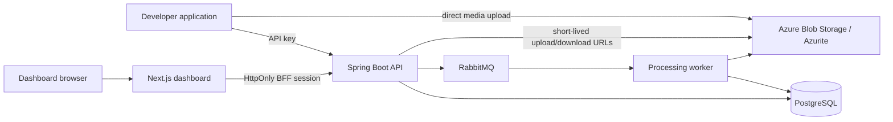

# Sluice

Sluice is an API-first media processing platform. A developer application authenticates with a project API key, uploads media directly to object storage, starts a versioned pipeline run, and reads the durable run result through the API. The Next.js dashboard is the human control plane for projects, keys, assets, runs, governance, and testing.

This repository is an early, working foundation, not the finished V1. Identity, project isolation, API keys, reusable uploads, slug-based run creation, idempotency, durable asynchronous execution, versioned processor contracts, real bounded image processing, persisted governance decisions, a curated processor market, guided canonical JSON/Form pipeline authoring, a responsive developer dashboard, and local Prometheus/Grafana monitoring are implemented. Onboarding, operational UX completion, and Azure deployment remain planned work.

## What works today

- Professional responsive signup, login, logout, project creation, project switching, password visibility, and HttpOnly dashboard sessions.
- Project-scoped JWT and API-key authentication.
- One-time API-key reveal, hash-only persistence, revocation, and throttled last-used tracking.
- Project-isolated assets, pipelines, jobs, and dashboard queries.
- Direct Azure Blob/Azurite upload URLs, upload completion checks, and short-lived download URLs.
- Reusable `POST /uploads` and `POST /runs` APIs. Upload completion is separate from processing, so one asset can be run through multiple pipelines.
- Idempotency-key replay protection for run creation and upload completion, with conflicting key reuse rejected.
- Immutable pipeline slug/alias/version resolution, durable `StepRun` records, and a persisted queue outbox for each run.
- RabbitMQ-backed asynchronous jobs with worker processing, retries, recovery scans, and SSE job events.
- Versioned pipeline authoring with synchronized canonical JSON/Form editing, starter templates, schema-aware controls, processor-version validation, immutable publishing, stable aliases, and history.
- A responsive dashboard shell with keyboard skip navigation, mobile project/session controls, and pages for overview, assets, runs, governance, pipeline testing, login/signup, projects, API keys, pipelines, and the processor market.
- Double-submit CSRF protection on every authenticated state-changing dashboard proxy request.
- A one-command local launcher, an API-first smoke demo, a real RabbitMQ/Azurite integration test, and a Playwright browser golden path covering auth/session, password visibility, skip navigation, and mobile controls.
- RFC-style problem responses for validation, authentication, authorization, and database conflicts.

## Current limitations

The following are intentionally not claimed as complete yet:

- The old `/assets/{assetId}/complete?pipelineId=...` endpoint remains verified for compatibility; the dashboard and new integrations use separate `/uploads` and `/runs` endpoints.
- Step records persist outcomes, timings, errors, MIME/byte facts, processor metadata, output assets, and attempt history.
- WebP uses pinned `com.github.usefulness:webp-imageio:0.11.0`, verifies encode/decode capability at startup, defaults to quality 82, and fails closed if the native codec cannot load.
- Governance uses a deterministic local provider by default. Production selects the Azure Content Safety adapter with `SLUICE_GOVERNANCE_PROVIDER=azure`, `AZURE_CONTENT_SAFETY_ENDPOINT`, and `AZURE_CONTENT_SAFETY_API_KEY`.
- Dashboard counts, recent assets/jobs, pagination, and the cached PostgreSQL/RabbitMQ/Blob readiness snapshot are backed by API data. Search and notifications remain outside V1.
- Prometheus is available at `http://localhost:9090` and Grafana at `http://localhost:3001` after `docker compose up`; the provisioned dashboard covers HTTP traffic, runs, processors, governance, durable backlogs, queue publishing, Blob operations, webhooks, and dependency health.
- Authenticated API clients can inspect the generated OpenAPI 3 contract, including request/response schemas and authentication schemes, at `GET /api/v1/openapi.json`.
- Azure resources and deployment automation are not in this branch yet.
- Arbitrary custom processor code is outside V1 for safety reasons.

The detailed implementation plan is maintained locally in `SDD.md`. It is intentionally ignored by Git.

## Architecture



| Responsibility | Local development | V1 Azure target |
|---|---|---|
| Dashboard | Next.js development server | Azure Container App |
| API | Spring Boot process | Azure Container App |
| Worker | Spring AMQP/RabbitMQ listener | Queue-scaled Azure Container App |
| Relational data | PostgreSQL 16 | Azure Database for PostgreSQL Flexible Server |
| Media bytes | Azurite | Private Azure Blob Storage |
| Work queue | RabbitMQ | Azure Service Bus |
| Secrets | Environment variables | Key Vault and Managed Identity |
| Telemetry | Actuator, Prometheus, and Grafana | Azure Monitor/Application Insights, retaining the same domain signals |

The API creates state and queues work. Workers perform media processing. Project IDs are enforced in the authentication context and repository queries. The browser never receives the dashboard JWT; the Next.js backend-for-frontend stores it in an HttpOnly cookie.

## Technology

- Java 17, Spring Boot 4.1, Spring MVC, Spring Security, Spring Data JPA
- PostgreSQL and Flyway
- RabbitMQ and Spring AMQP
- Azure Blob Storage SDK with Azurite for local development
- Next.js 16, React 19, TypeScript, Tailwind CSS, and TanStack Query
- Gradle, npm, Docker Compose, JUnit, Mockito, and Testcontainers

## Prerequisites

- Java 17
- Node.js 20.9 or newer with npm
- Docker Desktop with the Docker engine running

Docker is required for the local PostgreSQL/RabbitMQ/Azurite stack and for backend integration tests. The integration tests create a disposable PostgreSQL database named `sluice_test`; they do not clean or reuse the development database.

Check Docker before testing:

```powershell
docker version
```

If Testcontainers reports that it cannot find a Docker environment, start Docker Desktop and rerun the command above before running Gradle tests.

## Start the local application

From the repository root, start the complete local stack with one command:

```powershell
.\scripts\start-local.ps1
```

This starts Docker infrastructure plus the backend and frontend, waits for readiness, and writes process output under the ignored `.sluice/logs` directory. Stop it without deleting local Docker volumes:

```powershell
.\scripts\stop-local.ps1
```

To run each layer interactively instead, start local infrastructure:

```powershell
docker compose up -d
```

Start the backend in a second terminal:

```powershell
cd backend
.\gradlew.bat bootRun
```

Start the dashboard in a third terminal:

```powershell
cd frontend
npm ci
npm run dev
```

Open [http://localhost:3000/signup](http://localhost:3000/signup), create an account and project, then open Settings to create an API key. The backend listens on [http://localhost:8080](http://localhost:8080). RabbitMQ management is at [http://localhost:15672](http://localhost:15672).

After the application is ready, exercise the complete API-first flow with the committed deterministic fixture:

```powershell
.\scripts\demo-local.ps1
```

The script creates an isolated demo account and key, publishes `demo-webp`, uploads the PNG fixture directly to Azurite, starts a durable run through RabbitMQ, verifies the ALLOW governance result and WebP output, downloads that output, and prints a concise JSON result. It does not reveal the generated API key.

Stop the local services while retaining their Docker volumes:

```powershell
docker compose down
```

To remove the local database, queue, and Azurite data as well, use `docker compose down -v`. This deletes only the named local Compose volumes.

## API-first developer flow

The dashboard is useful for creating a project and revealing a key, but applications should use the API.

### Authentication

Human dashboard requests use a JWT and `X-Project-ID`. Machine requests use a project API key:

```http
X-API-Key: sl_live_<one-time-secret>
```

The raw key is returned only from `POST /api/v1/projects/{projectId}/api-keys`. Sluice stores a SHA-256 hash and cannot show the raw value again.

### Current endpoint flow

All paths below include the `/api/v1` prefix.

| Method | Endpoint | Purpose |
|---|---|---|
| `POST` | `/auth/signup` | Create a user and owner project; returns a JWT for initial setup |
| `POST` | `/auth/login` | Authenticate a human user |
| `GET` | `/auth/me` | Read the current user and memberships |
| `GET/POST` | `/projects` | List or create projects |
| `GET/POST` | `/projects/{id}/api-keys` | List key metadata or create/reveal a key |
| `DELETE` | `/projects/{id}/api-keys/{keyId}` | Revoke a key |
| `GET` | `/processors` | List published processors plus deprecated release history and their contracts |
| `GET/POST` | `/pipelines` | List or create project pipelines |
| `GET` | `/pipelines/published` | List published pipelines available to the project |
| `GET` | `/pipelines/{slug}` | Read a pipeline draft, aliases, and current state |
| `GET` | `/pipelines/{slug}/versions` | Read immutable version history |
| `PUT` | `/pipelines/{slug}/draft` | Create/update a revision-checked draft |
| `POST` | `/pipelines/{slug}/validate` | Validate a draft or candidate definition |
| `POST` | `/pipelines/{slug}/publish` | Validate and publish a draft immutably |
| `PUT` | `/pipelines/{slug}/aliases/{alias}` | Move an alias to a published version |
| `POST` | `/uploads` | Create a pending asset and write-only upload URL |
| `POST` | `/uploads/{assetId}/complete` | Verify and finalize an asset without starting work; supports `Idempotency-Key` |
| `POST` | `/runs` | Start a run using a pipeline slug and optional alias or immutable version; supports `Idempotency-Key` |
| `GET` | `/runs`, `/runs/{id}` | List or inspect durable runs, planned steps, and outputs |
| `GET` | `/runs/{id}/outputs` | List output assets produced by a run |
| `GET` | `/runs/{id}/events` | Subscribe to authenticated SSE run events |
| `POST` | `/assets/upload-url` | Legacy pending asset URL endpoint |
| `POST` | `/assets/{assetId}/complete?pipelineId={id}` | Legacy verify-and-queue endpoint |
| `GET` | `/assets`, `/assets/{id}` | List or inspect project assets |
| `GET` | `/assets/{id}/download` | Create a short-lived download URL |
| `GET` | `/jobs`, `/jobs/{id}` | List or inspect jobs |
| `GET` | `/jobs/{id}/events` | Subscribe to authenticated SSE job events |
| `GET` | `/dashboard` | Read the current dashboard overview |

The preferred flow completes the upload first, then starts one or more runs:

1. `POST /uploads` with `{filename, contentType, size}`.
2. PUT the bytes to the returned SAS URL.
3. `POST /uploads/{assetId}/complete`.
4. `POST /runs` with `{pipeline: "product-images", alias: "stable", inputAssetId: "..."}`.
5. Poll `GET /runs/{id}` or subscribe to `GET /runs/{id}/events`.

### API key upload example

After creating a key and publishing a pipeline with slug `product-images`, request an upload URL:

```powershell
$api = "http://localhost:8080/api/v1"
$headers = @{ "X-API-Key" = $env:SLUICE_API_KEY }
$body = @{ filename = "photo.png"; contentType = "image/png"; size = (Get-Item .\photo.png).Length } | ConvertTo-Json
$upload = Invoke-RestMethod -Method Post -Uri "$api/uploads" -Headers $headers -ContentType "application/json" -Body $body
```

Upload the bytes directly to the returned SAS URL, then complete the upload:

```powershell
Invoke-WebRequest -Method Put -Uri $upload.uploadUrl `
  -Headers @{ "x-ms-blob-type" = "BlockBlob"; "Content-Type" = "image/png" } `
  -InFile .\photo.png

Invoke-RestMethod -Method Post `
  -Uri "$api/uploads/$($upload.assetId)/complete" `
  -Headers ($headers + @{ "Idempotency-Key" = "upload-photo-001" })
```

Start a reusable run against the completed asset:

```powershell
$runBody = @{ pipeline = "product-images"; alias = "stable"; inputAssetId = $upload.assetId } | ConvertTo-Json
$run = Invoke-RestMethod -Method Post -Uri "$api/runs" `
  -Headers ($headers + @{ "Idempotency-Key" = "run-photo-001" }) `
  -ContentType "application/json" -Body $runBody

Invoke-RestMethod -Method Get -Uri "$api/runs/$($run.id)" -Headers $headers
```

## Configuration

Local defaults are defined in `backend/src/main/resources/application.properties` and match `docker-compose.yml`. Override them with environment variables; never commit real credentials.

| Variable | Purpose | Local default |
|---|---|---|
| `SLUICE_DB_URL` | API PostgreSQL JDBC URL | `jdbc:postgresql://localhost:5432/sluice` |
| `SLUICE_DB_USERNAME` | API database user | `sluice` |
| `SLUICE_DB_PASSWORD` | API database password | `sluice_password` |
| `SLUICE_FLYWAY_URL` | Optional Flyway JDBC URL | API database URL |
| `SLUICE_FLYWAY_USERNAME` | Optional Flyway user | API database user |
| `SLUICE_FLYWAY_PASSWORD` | Optional Flyway password | API database password |
| `AZURE_STORAGE_CONNECTION_STRING` | Blob/Azurite connection string | Local Azurite account |
| `AZURE_STORAGE_CONTAINER_NAME` | Blob container | `assets` |
| `AZURE_STORAGE_CONFIGURE_CORS` | Mutate storage CORS at startup | `true` locally; false in production |
| `SLUICE_CORS_ALLOWED_ORIGINS` | Allowed browser origins | `http://localhost:3000` |
| `SLUICE_JWT_SECRET` | JWT signing secret | Development-only fallback |
| `SPRING_PROFILES_ACTIVE` | Activate production-required settings | Set to `production` in Azure |
| `API_BASE_URL` | Backend URL used by the Next.js BFF | `http://localhost:8080/api/v1` |

Production must supply a strong JWT secret and managed database, storage, queue, CORS, and API URL settings. `application-production.properties` intentionally has no source-code fallbacks for required database, storage, JWT, and CORS values.

## Verification

Backend tests must be run from `backend`:

```powershell
.\gradlew.bat test --rerun-tasks --console=plain
```

The default suite uses Testcontainers PostgreSQL and the `test` profile. It disables RabbitMQ listener startup, scheduled job recovery, and real Azure Blob initialization. It should finish with zero failures.

The separate task runs the tagged real-infrastructure flow using disposable PostgreSQL, RabbitMQ, and Azurite containers:

```powershell
.\gradlew.bat externalIntegrationTest --console=plain
```

It verifies signup and key creation, canonical pipeline publication, direct Blob upload, outbox/RabbitMQ delivery, worker execution, governance persistence, WebP output, and output download.

Frontend checks must be run from `frontend`:

```powershell
npm run lint
npm run build
npx playwright install chromium
npm run test:e2e
```

The browser test expects the local application to be running. It covers signup validation, the HttpOnly session, CSRF rejection, project creation/selection, one-time API-key reveal and revocation, logout/login failure and success, pipeline JSON publication, test upload, durable run completion, output facts, and governance UI. GitHub Actions exposes separate `Verify backend` and `Verify frontend` checks that run in parallel. `Verify product golden path` depends on both and then runs the real broker/storage integration, browser golden path, and API smoke path.

`git diff --check` is also expected to pass before a commit.

## Repository layout

```text
backend/    Spring Boot API, workers, migrations, and tests
frontend/   Next.js dashboard and backend-for-frontend routes
docker-compose.yml
README.md   This developer guide
SDD.md      Local architectural reference, ignored by Git
```

## Security boundaries

- Every tenant resource is scoped to a project.
- Human JWTs and the selected project are stored server-side in HttpOnly cookies by the Next.js BFF.
- Authenticated BFF mutations require a random `X-Sluice-CSRF` value matching the SameSite CSRF cookie; missing or mismatched values fail with `403 csrf_rejected`.
- API keys are high-entropy, revealed once, hashed at rest, project-scoped, and revocable.
- Default tests use an isolated database rather than developer data.
- Blob containers are private and upload/download access uses short-lived SAS URLs.
- Arbitrary executable processor code, unrestricted graphs, remote URL processing, quotas, and custom marketplace submissions are not V1 capabilities.

## Roadmap and Azure status

The remaining V1 path is:

1. Separate upload/run APIs with durable step data and signed terminal webhooks. *(Implemented)*
2. Product surface, fixed API/media safety limits, generated OpenAPI, and operational metrics over the implemented processing/governance core. *(Implemented)*
3. Run the clean-checkout local product gate and browser golden path. *(Implemented)*
4. Product-experience completion: public landing page, processor market, guided pipeline authoring, onboarding/quick start, test-console, run inspection, and finishing UX. *(In progress: responsive shell, authentication, public landing page, processor market, and guided pipeline authoring are implemented; onboarding and operational UX remain.)*
5. Terraform, Azure Container Apps, Service Bus, managed PostgreSQL/Blob, Key Vault, API Management, and Azure telemetry. *(After product-experience completion)*

Azure deployment is part of the final demo, but it has not been implemented on this branch. Read the local `SDD.md` for the dependency-ordered ticket plan and current acceptance gates.
