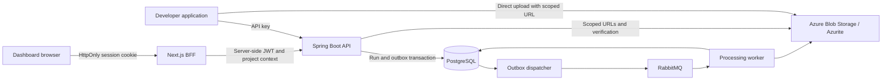

<p align="center">
  
</p>

# Sluice

[](https://github.com/sluice-hq/sluice/actions/workflows/ci.yml)
[](LICENSE)

Sluice is an API-first media-processing platform. Applications upload media directly to object storage, start an asynchronous run against an immutable pipeline version, and retrieve durable run and output data. The Next.js dashboard is the control plane for projects, API keys, processors, pipelines, and operational inspection.

The repository provides a verified local product flow. Azure deployment automation and infrastructure are not implemented.

## Capabilities

- Project-scoped JWT and API-key access, one-time API-key reveal, hash-only key storage, revocation, and an HttpOnly dashboard session.
- Direct Azure Blob Storage or Azurite uploads with completion verification and short-lived download URLs.
- Versioned processor releases; revision-checked pipeline drafts; immutable published versions and aliases; contract validation before publication and execution.
- Durable asynchronous runs with PostgreSQL-backed outbox delivery, RabbitMQ workers, retry/recovery handling, step facts, output provenance, Server-Sent Events, and signed terminal webhooks.
- Processor market, guided and JSON pipeline authoring, first-run checklist, API Quick Start, pipeline test console, and asset/run/governance inspection.
- Local Prometheus and Grafana monitoring, plus backend, integration, API-smoke, and Playwright browser verification.

## Architecture



The API commits each run and its queue event together in PostgreSQL. The outbox dispatcher publishes pending work to the broker, and workers process media and persist results. The dashboard's backend-for-frontend keeps the JWT server-side, so browser JavaScript receives only the HttpOnly session cookie.

| Responsibility | Local implementation | Azure target architecture |
|---|---|---|
| API and worker | Spring Boot process and RabbitMQ listener | Separate Azure Container Apps |
| Dashboard | Next.js | Azure Container App |
| Durable data | PostgreSQL 16 | Azure Database for PostgreSQL Flexible Server |
| Media | Azurite | Private Azure Blob Storage |
| Queue | RabbitMQ | Azure Service Bus |
| Observability | Actuator, Prometheus, Grafana | Azure Monitor and Application Insights |

RabbitMQ is the current local broker. Azure Service Bus is a planned adapter, not a deployed component.

## Processors

Built-in processor releases cover validation, image metadata, checksums, resize, metadata stripping, WebP conversion, and content-safety governance. Processor definitions declare versioned input/output contracts and configuration schemas; pipeline steps pin an exact release.

| Processor | Current behavior |
|---|---|
| `mime-validation` | Checks configured allowed types using basic Java content detection. |
| `metadata` and `checksum` | Read image facts and produce a SHA-256 checksum. |
| `resize` | Performs bounded, aspect-preserving image resize. |
| `strip-metadata` | Rewrites supported JPEG, PNG, and WebP images without EXIF, GPS, camera, comment, or color-profile data. |
| `webp` | Produces deterministic WebP output with bounded quality settings and startup codec verification. |
| `governance.content-safety` | Persists `ALLOW`, `REVIEW`, or `BLOCK` decisions from the configured provider. |

Local governance uses a deterministic provider so tests can exercise all decision paths without network access. It is a test double, not AI moderation or a real harmful-content classifier. The Azure AI Content Safety adapter is configured only when explicitly enabled and has no live Azure smoke coverage in this repository.

## Quick start

Prerequisites:

- Java 17
- Node.js 20.9 or later with npm
- Docker Desktop with the Docker engine running

Start the full local stack from the repository root:

```powershell
.\scripts\start-local.ps1
```

The script starts PostgreSQL, RabbitMQ, Azurite, Prometheus, Grafana, the API, and the dashboard. It waits for the API and dashboard, then prints their local addresses. Open [http://localhost:3000/signup](http://localhost:3000/signup) to create an account and project.

Run the deterministic API-first demonstration after the stack is ready:

```powershell
.\scripts\demo-local.ps1
```

It creates a demo account and API key, publishes the included `demo-webp` pipeline, transfers a PNG to Azurite, waits for the RabbitMQ-backed run, verifies the governance result and WebP output, then downloads that output.

Stop local processes and services while retaining Compose volumes:

```powershell
.\scripts\stop-local.ps1
```

For interactive development, start the infrastructure from the repository root:

```powershell
docker compose up -d
```

Then run the API and dashboard in separate terminals:

```powershell
cd backend
.\gradlew.bat bootRun
```

```powershell
cd frontend
npm ci
npm run dev
```

## API workflow

Use the dashboard to create a project and reveal an API key, then use the API from an application. Machine requests authenticate with:

```http
X-API-Key: sl_live_<one-time-secret>
```

The preferred upload-and-run sequence is:

1. Create a pending asset with `POST /api/v1/uploads`, an `Idempotency-Key`, and `filename`, `contentType`, and `size`. Applications may also provide `externalSubjectId` and `externalReference` as stable correlation identifiers.
2. PUT the bytes to the returned write-only SAS URL.
3. Finalize the asset with `POST /api/v1/uploads/{assetId}/complete` and an `Idempotency-Key`.
4. Start a run with `POST /api/v1/runs`, specifying a published pipeline slug, alias or version, and `inputAssetId`.
5. Poll `GET /api/v1/runs/{id}`, subscribe to `/api/v1/runs/{id}/events`, or receive a signed terminal webhook.

External references are optional opaque identifiers scoped to the authenticated Sluice project. They are returned on input and derived assets and support exact `GET /api/v1/assets?externalSubjectId=...&externalReference=...` filtering. They are not authentication claims: use stable internal IDs such as `user_123`, never usernames, email addresses, access tokens, or other personal or secret values.

Asset discovery is server-side and paginated. `GET /api/v1/assets` accepts a case-insensitive literal `filename` search, exact `status`, MIME-family `mediaType` such as `image`, inclusive `createdFrom`, exclusive `createdBefore`, and the exact external-reference filters above. Filters compose inside the authenticated project boundary. Results default to stable `createdAt DESC, id DESC` ordering; callers overriding the order can repeat `sort` to retain a unique tie-breaker, for example `sort=filename,asc&sort=id,asc`.

Before authoring a new pipeline, a project manager must enable the exact processor releases it will use. The dashboard uses `GET /api/v1/projects/{projectId}/processor-releases`; enable or disable a release with `PUT` or `DELETE` on `.../{slug}/versions/{version}`. Enablement is project-scoped, and disabling a release does not invalidate already-published pipeline versions.

Example PowerShell request sequence:

```powershell
$api = "http://localhost:8080/api/v1"
$headers = @{ "X-API-Key" = $env:SLUICE_API_KEY }
$body = @{ filename = "photo.png"; contentType = "image/png"; size = (Get-Item .\photo.png).Length; externalSubjectId = "user_123"; externalReference = "avatar_2026_08" } | ConvertTo-Json
$upload = Invoke-RestMethod -Method Post -Uri "$api/uploads" -Headers ($headers + @{ "Idempotency-Key" = "upload-create-001" }) -ContentType "application/json" -Body $body

Invoke-WebRequest -Method Put -Uri $upload.uploadUrl -Headers @{ "x-ms-blob-type" = "BlockBlob"; "Content-Type" = "image/png" } -InFile .\photo.png
Invoke-RestMethod -Method Post -Uri "$api/uploads/$($upload.assetId)/complete" -Headers ($headers + @{ "Idempotency-Key" = "upload-complete-001" })

$runBody = @{ pipeline = "product-images"; alias = "stable"; inputAssetId = $upload.assetId } | ConvertTo-Json
$run = Invoke-RestMethod -Method Post -Uri "$api/runs" -Headers ($headers + @{ "Idempotency-Key" = "run-create-001" }) -ContentType "application/json" -Body $runBody
Invoke-RestMethod -Method Get -Uri "$api/runs/$($run.id)" -Headers $headers
Invoke-RestMethod -Method Get -Uri "$api/assets?externalSubjectId=user_123&externalReference=avatar_2026_08" -Headers $headers
```

Authenticated API clients can request the generated OpenAPI contract at [`/api/v1/openapi.json`](http://localhost:8080/api/v1/openapi.json). The signed-in dashboard exposes the same contract through its authenticated proxy.

## Configuration

[`.env.example`](.env.example) is the safe reference for Sluice-specific environment settings. Copy only the values you need into a local process environment or deployment secret store; do not commit populated secrets. Local defaults in [`backend/src/main/resources/application.properties`](backend/src/main/resources/application.properties) match `docker-compose.yml`.

| Variable | Purpose | Local default or expectation |
|---|---|---|
| `API_BASE_URL` | API origin used by the Next.js BFF | `http://localhost:8080/api/v1` |
| `SLUICE_PUBLIC_API_BASE_URL` | Public API origin shown by Quick Start | `http://localhost:8080/api/v1` |
| `SLUICE_DB_URL`, `SLUICE_DB_USERNAME`, `SLUICE_DB_PASSWORD` | PostgreSQL connection | Compose-compatible local defaults |
| `AZURE_STORAGE_CONNECTION_STRING` | Azure Blob Storage or Azurite connection | Local Azurite default in application config |
| `AZURE_STORAGE_CONTAINER_NAME` | Blob container | `assets` |
| `SLUICE_JWT_SECRET` | Dashboard/API JWT signing secret | Replace for any non-local environment |
| `SLUICE_CORS_ALLOWED_ORIGINS` | Allowed dashboard origin | `http://localhost:3000` |
| `SLUICE_GOVERNANCE_PROVIDER` | `local` deterministic provider or `azure` adapter | `local` |
| `AZURE_CONTENT_SAFETY_ENDPOINT`, `AZURE_CONTENT_SAFETY_API_KEY` | Azure provider credentials | Required only for `azure` governance |
| `SLUICE_MEDIA_*`, `SLUICE_IMAGE_*` | Upload and image-processing safety limits | See `.env.example` |

The production profile requires database, storage, JWT, and CORS configuration from its environment; it intentionally does not provide source-code fallbacks for those values.

## Testing

Run backend tests from `backend`:

```powershell
.\gradlew.bat test --console=plain
.\gradlew.bat externalIntegrationTest --console=plain
```

The default suite uses Testcontainers PostgreSQL. The external integration test uses disposable PostgreSQL, RabbitMQ, and Azurite containers to verify the end-to-end processing path.

Run frontend checks from `frontend`:

```powershell
npm run lint
npm run build
npx playwright install chromium
npm run test:e2e
```

The browser test requires the local application to be running. It covers authentication and session behavior, CSRF rejection, projects and keys, pipeline publication, upload/run/output, and governance. GitHub Actions runs backend and frontend checks in parallel, then runs the integration, browser, and API-smoke paths in a dependent product gate.

Before committing, check whitespace errors from the repository root:

```powershell
git diff --check
```

## Repository layout

```text
backend/                 Spring Boot API, worker, Flyway migrations, and tests
frontend/                Next.js dashboard and backend-for-frontend routes
demo/                    Deterministic pipeline and media fixture for the local demo
monitoring/              Prometheus and Grafana provisioning
scripts/                 Local start, stop, and API-smoke scripts
docker-compose.yml       Local PostgreSQL, RabbitMQ, Azurite, Prometheus, Grafana
.env.example             Safe configuration reference
```

## Security boundaries

- Tenant data is project-scoped in the authentication context and application queries.
- The dashboard stores its JWT in an HttpOnly, SameSite cookie; the BFF forwards it server-side.
- State-changing dashboard proxy requests require a matching `X-Sluice-CSRF` header and SameSite CSRF cookie.
- API keys use 256 bits of randomness, are shown once, stored only as SHA-256 hashes, project-scoped, and revocable.
- Blob containers are private. Upload and download access uses short-lived SAS URLs.
- Pipeline contracts and media limits constrain supported content; arbitrary custom processor code, remote-URL processing, unrestricted graphs, quotas, and custom marketplace submissions are not implemented V1 capabilities.

## Deployment status

Sluice currently runs locally with Docker Compose and a Spring Boot/Next.js development setup. There is no `infra/` directory, Terraform, Azure resource provisioning, container-image publication, or automated deployment in this repository.

The intended Azure architecture uses Container Apps, API Management, Azure Database for PostgreSQL, Blob Storage, Service Bus, Key Vault, and Azure Monitor/Application Insights. It remains a target design, not a release claim.

## License

Sluice is licensed under the [Apache License 2.0](LICENSE).
